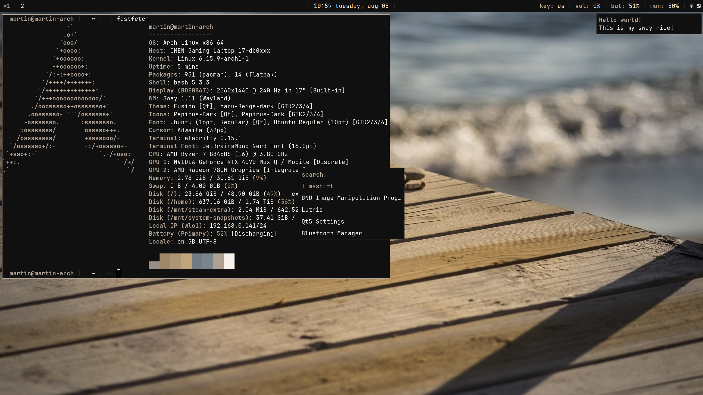

# 
Welcome to my dotfiles!

## Introduction
This repository contains the configuration files for my sway setup on Linux.

To install this setup, first install all the dependencies listed below, and then simply copy all the configuration files to your system.

## Dependencies
To use my configuration you will need to install the following:
- `sway`
- `swayidle`
- `swaybg`
- `alacritty`
- `waybar`
- `dunst`
- `rofi-wayland`
- `hyprlock`
- `brightnessctl`
- `alsa-utils`
- `acpid`

## Looking for something else?
This repository used to contain dotfiles for a dwm setup. However, I have since switched to sway, and updated this repository to reflect my current configuration.

If you have starred this repository in the past, and are looking for the dwm dotfiles, you can now find them here: https://github.com/programmeter-static-dotfiles/dwm-dotfiles-nord
